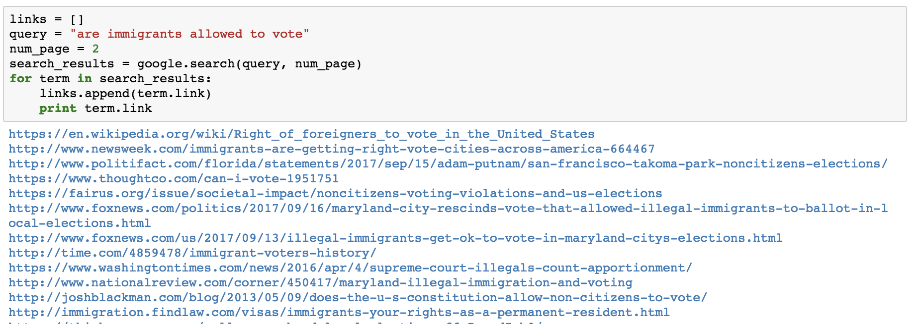
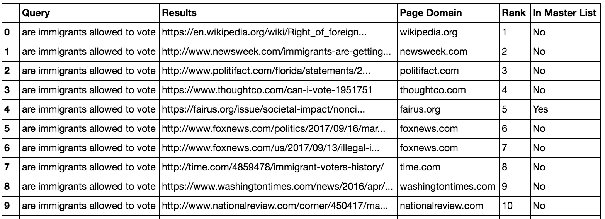
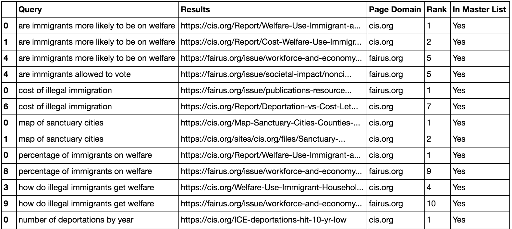

# Google Search Hate Speech Websites Identifier

[Southern Poverty Law Center (SPLC)](https://www.splcenter.org) is an organization that monitors hate groups and other extremists throughout the U.S. and exposes their activities to law enforcement agencies, the media and the public.

In this project, developed in a DataKind data dive, in partnership with SPLC we created a tool to automatically identify "blacklisted" websites per search query, the objective of the project was to measure how innocuous queries might lead to hate speech websites and reach more people.  

The developed code get for each query in string format the top results in Google Search, check if the results are in the Master List provided by Southern Poverty Law Center, and return the number of times they appear for each search.
**Inputs**:
- Master List -> HateDomainMasterList_Clean.csv
- List of Queries -> ['are immigrants more likely to be on welfare', 'are immigrants allowed to vote', ...] (example)

**Output**:
- Table with all the results from queries, the rank they appear in the search and if it is in masterlist. (exported in .csv)

### Example
- Search on Google (innocuous query): **"are immigrants allowed to vote"**, and return the top n pages results

- Output as Pandas DataFrame with the information if it is in Master List or not and the rank it was shown in Google Search.

- You can also do multiple queries at once:

 
